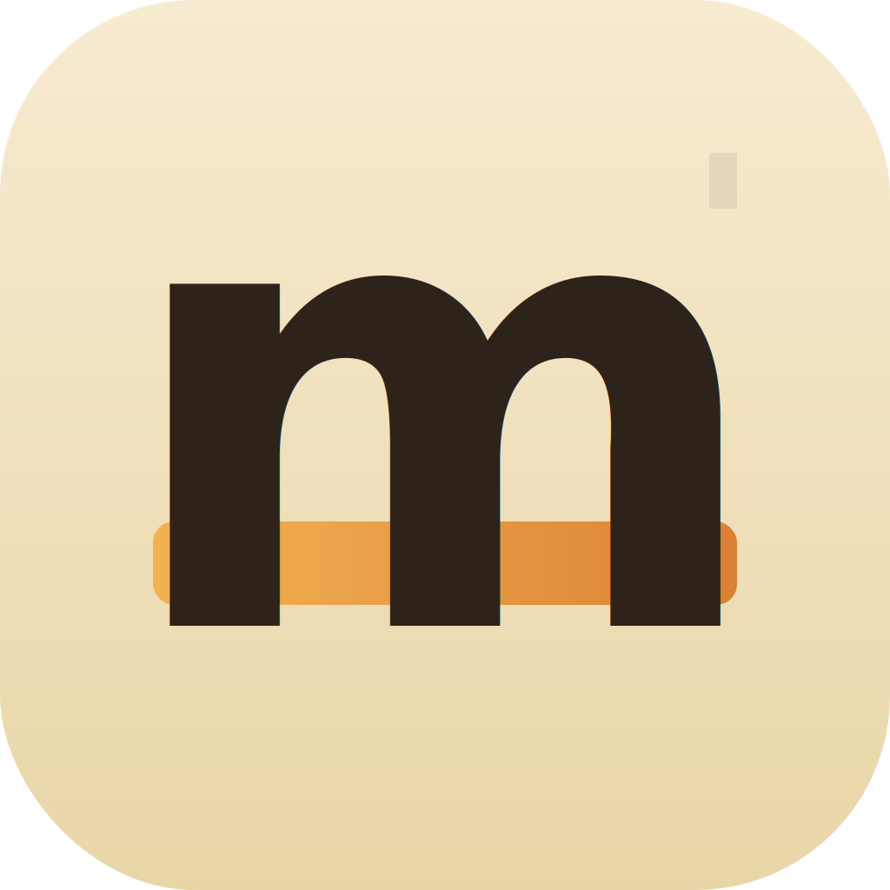

<p align="center">
  
</p>

<h1 align="center">Mindle</h1>

<p align="center">
  <em>A quiet place to read Markdown.</em>
</p>

<p align="center">
  <a href="#install">Install</a> &bull;
  <a href="#features">Features</a> &bull;
  <a href="#keyboard-shortcuts">Shortcuts</a> &bull;
  <a href="#build-from-source">Build</a> &bull;
  <a href="#roadmap">Roadmap</a>
</p>

<p align="center">
  
  
  
  
</p>

---

**Mindle** is a native macOS Markdown reader built for focused, distraction-free reading. Think of it as a personal e-reader for your `.md` files — serif typography, warm themes, and the ability to highlight and annotate passages without ever leaving the document.

No Electron. No subscriptions. No network calls. Just a fast, local, single-binary SwiftUI app.

## Install

### Download (recommended)

Grab the latest `Mindle.app.zip` from [**Releases**](https://github.com/nonatofabio/mindle/releases), unzip, and drag to `/Applications`.

### Build from source

```bash
git clone https://github.com/nonatofabio/mindle.git
cd mindle
./build.sh
open build/Mindle.app
```

Requires **macOS 14+** and **Xcode Command Line Tools** (`xcode-select --install`).

## Features

- **Full GitHub-Flavored Markdown** — tables, task lists, footnotes, strikethrough, syntax-highlighted code blocks, emoji, nested lists, raw HTML. Powered by [markdown-it](https://github.com/markdown-it/markdown-it) + [highlight.js](https://highlightjs.org), rendered in a local WebKit view.
- **Highlight & Annotate** — select any passage and press `⌘⇧H` to highlight or `⌘⇧N` to attach a note. Works across paragraphs, headings, lists, and code blocks.
- **Annotations Sidebar** — toggle with `⌘⇧A`. Click any annotation to jump to its passage. Notes are editable inline.
- **Three Themes** — Light, Sepia, and Dark. Cycle with `⌘⇧T`.
- **Typography Controls** — scale the serif reading font with `⌘+` / `⌘-`.
- **Persistent Annotations** — saved to a hidden `.yourfile.md.mindle.json` sidecar next to your file. Nothing leaves your machine.
- **Open With** — associate `.md` files with Mindle in Finder. Drag-and-drop supported.
- **Zero Dependencies at Runtime** — single app bundle, no frameworks to install, no network access.

## Keyboard Shortcuts

| Shortcut | Action |
|----------|--------|
| `⌘O` | Open a file |
| `⌘⇧E` | Export annotations (Markdown or JSON) |
| `⌘⇧H` | Highlight selection |
| `⌘⇧N` | Add note to selection |
| `⌘⇧A` | Toggle annotations sidebar |
| `⌘⇧T` | Cycle theme (light / sepia / dark) |
| `⌘+` / `⌘-` | Increase / decrease font size |

## Architecture

```
SwiftUI shell (toolbar, sidebar, theme state)
  └── WKWebView (reader pane)
        ├── markdown-it     → Markdown → HTML
        ├── highlight.js    → syntax coloring
        └── reader.js       → annotation overlay (non-destructive DOM marks)
```

Annotations use a **text + context** anchoring strategy (inspired by [Hypothes.is](https://web.hypothes.is/)): each highlight stores the selected text plus 48 chars of prefix/suffix. This means highlights survive minor edits to the source file.

## Roadmap

- [ ] **Search** (`⌘F`) — find-in-document with match highlighting
- [x] **Export annotations** — Markdown or JSON dump of all highlights and notes
- [ ] **Multiple files** — tabbed or sidebar-based file browser
- [ ] **Mermaid diagrams** — render `mermaid` fenced code blocks inline
- [ ] **Image support** — resolve relative image paths from the `.md` file's directory
- [ ] **Print / PDF export** — `⌘P` with theme-aware print stylesheet
- [ ] **Homebrew cask** — `brew install --cask mindle`
- [ ] **iOS / iPadOS app** — multiplatform build sharing the same WebKit reader and annotation engine

## License

[MIT](LICENSE) — use it, fork it, make it yours.
